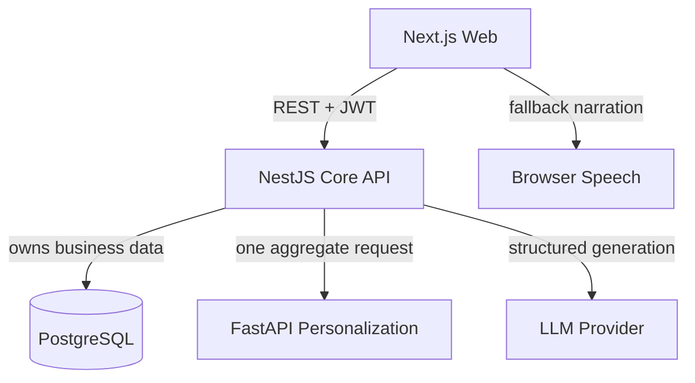

# Architecture

EduRecall separates business ownership, personalization intelligence and generative assistance. The boundaries are deliberate: a Python model cannot silently change enrollment, published content or review state.

## Web

The Next.js App Router provides separate student and teacher workspaces. A browser demo state calls the API when available and exposes an explicit fallback label when it is not. It never renders provider-generated HTML; micro-lessons are structured data rendered through registered animation templates.

## NestJS core

NestJS owns authentication, RBAC, courses, learning events, attempts, personalization orchestration, recommendations, review schedules, content workflow, games, gamification and audit metadata. `LearningService` stores a pending attempt before it calls FastAPI. A bounded timeout, retry and deterministic fallback keep the learning flow available.

## Python service

FastAPI accepts `AnalyzeEventRequest` and returns an analysis. It has no business database connection. The aggregate operation composes BKT, forgetting, domain-rule diagnosis, next-attempt prediction and recommendation scoring.

## Database

PostgreSQL is represented by the Prisma schema and migration. Foreign keys, compound unique constraints, indexes and explicit cascade behavior protect lifecycle boundaries. The runtime demo store exists only to make hackathon judging possible before Docker setup; the persistence design and seed remain database-ready.

## LLM and TTS

`ExternalLlmProvider` connects to FPT AI Marketplace and uses `DeepSeek-V4-Flash` when enabled by environment variables. Its output is normalized and checked by the same structured-content validator before entering `DRAFT`; a teacher must approve and publish it. `LocalTemplateProvider` remains the zero-key fallback. Narration is generated server-side by `FPT.AI-VITs`, returned as WAV and cached by model, voice and text; Browser SpeechSynthesis is only the final fallback.

## Attempt flow

1. Validate request and idempotency key.
2. Record `PENDING_ANALYSIS` learning event and attempt.
3. Call one FastAPI aggregate endpoint with correlation ID.
4. Validate the response contract.
5. Persist diagnosis, state history, recommendation evidence and review schedule.
6. Mark the event `ANALYZED` or `FALLBACK_ANALYZED`.

## Deployment

Docker Compose exposes web `3000`, API `4000`, FastAPI `8001` and PostgreSQL `5432`. In production, the FastAPI service should be private, TLS should terminate at a gateway and uploads should go through object storage plus malware scanning.
