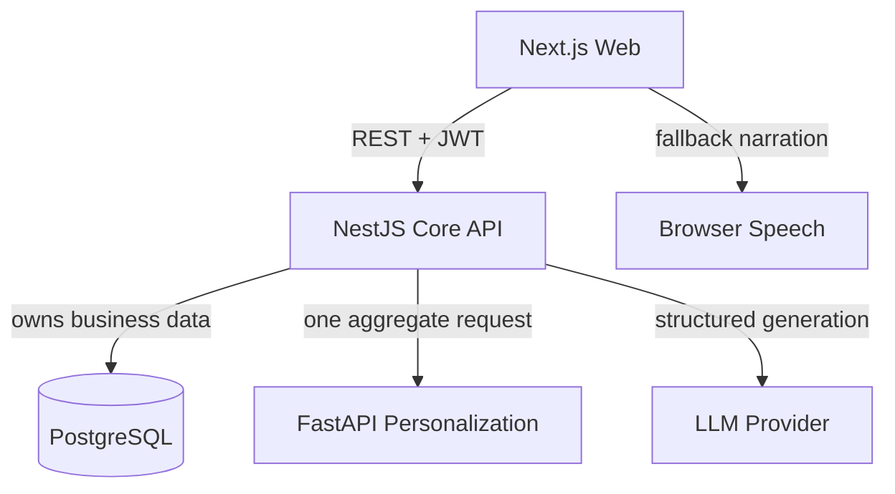

# Architecture

EduRecall separates business ownership, personalization intelligence and generative assistance. The boundaries are deliberate: a Python model cannot silently change enrollment, published content or review state.

## Web

The Next.js App Router provides separate student and teacher workspaces. Product state comes from the NestJS API; the browser has request de-duplication/loading state but no business-data fallback. It never renders provider-generated raw HTML or JavaScript; micro-lessons are structured data rendered through registered animation templates.

## NestJS core

NestJS owns authentication, RBAC, courses, learning events, attempts, personalization orchestration, recommendations, review schedules, content workflow, games, gamification and audit metadata. `LearningService` stores a pending attempt before it calls FastAPI. A bounded timeout, retry and deterministic fallback keep the learning flow available.

## Python service

FastAPI accepts `AnalyzeEventRequest` and returns an analysis. It has no business database connection. The aggregate operation composes BKT, forgetting, domain-rule diagnosis, next-attempt prediction and recommendation scoring.

## Database

Supabase PostgreSQL is the runtime source of truth through Prisma. Foreign keys, compound unique constraints, indexes and explicit cascade behavior protect lifecycle boundaries. Attempts, personalization runs, recommendations, content versions/reviews and audit logs are persisted; there is no runtime demo store or deploy-time seed/reset.

## LLM and TTS

`ExternalLlmProvider` connects to FPT AI Marketplace and uses `DeepSeek-V4-Flash` when enabled by environment variables. Its output is normalized and checked by the same structured-content validator before entering `DRAFT`; a teacher must approve and publish it. `LocalTemplateProvider` remains the zero-key fallback. Narration is generated server-side by `FPT.AI-VITs`, returned as WAV and cached by model, voice and text; Browser SpeechSynthesis is only the final fallback.

## Attempt flow

1. Validate request and idempotency key.
2. Record `PENDING_ANALYSIS` learning event and attempt.
3. Call one FastAPI aggregate endpoint with correlation ID.
4. Validate the response contract.
5. Persist diagnosis, state history, recommendation evidence and review schedule.
6. Mark the event `ANALYZED` or `FALLBACK_ANALYZED`.

## Deployment

Local development exposes web `3000`, API `4000` and FastAPI `8001`, all using Supabase. The Checkpoint 2 Render configuration runs the three processes in one Docker Web Service: Next.js is public on Render's `$PORT`, while NestJS `4000` and FastAPI `8001` stay inside the container. This single-service shape is for the prototype/free tier; production should split FastAPI onto a private service and use object storage plus malware scanning for binary uploads.
