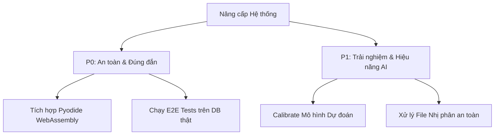

# 🛠️ Kế hoạch Khắc phục & Nâng cấp Kỹ thuật Dự án EduRecall AI
*Tài liệu hướng dẫn triển khai chi tiết dành cho Đại lý AI (AI Coding Agent)*

Tài liệu này tổng hợp toàn bộ các lỗi hiện tại, hạn chế thiết kế, rủi ro bảo mật và cung cấp chỉ dẫn kỹ thuật chi tiết từng bước (kèm mã nguồn mẫu và vị trí file) để một AI Agent khác có thể tiến hành nâng cấp hệ thống đạt tiêu chuẩn sản xuất (production-ready).

---

## 📋 Danh sách các Hạng mục Cần Triển khai



---

## Hạng mục P0: An toàn Kỹ thuật & Kiểm thử Tích hợp

### 1. Tích hợp Pyodide (WebAssembly Python) tại Client-Side
* **Vấn đề hiện tại:** Trải nghiệm lập trình của học sinh rất thô sơ, chỉ có ô `<textarea>` ([student-view-router.tsx:L314](file:///d:/DaiHoc/Nam3/AIForLive/apps/web/features/student/student-view-router.tsx#L314)). Chấm bài ở backend dùng so khớp chuỗi thô ([learning.service.ts:L17-L19](file:///d:/DaiHoc/Nam3/AIForLive/apps/api/src/learning-events/learning.service.ts#L17-L19)).
* **Hướng cải thiện:** Tích hợp Pyodide vào Next.js để thực thi code Python trực tiếp trên trình duyệt của học sinh.
* **Chỉ dẫn cho AI Agent:**
  1. Thêm CDN của Pyodide vào file layout hoặc import dynamic:
     ```typescript
     // CDN URL: https://cdn.jsdelivr.net/pyodide/v0.26.1/full/pyodide.js
     ```
  2. Tạo hook `usePyodide` trong `apps/web/lib/use-pyodide.ts`:
     ```typescript
     import { useEffect, useState } from "react";

     export function usePyodide() {
       const [pyodide, setPyodide] = useState<any>(null);
       const [loading, setLoading] = useState(true);

       useEffect(() => {
         const loadPyodideInstance = async () => {
           if (typeof window !== "undefined" && !(window as any).loadPyodide) {
             const script = document.createElement("script");
             script.src = "https://cdn.jsdelivr.net/pyodide/v0.26.1/full/pyodide.js";
             script.addEventListener("load", async () => {
               const py = await (window as any).loadPyodide();
               setPyodide(py);
               setLoading(false);
             });
             document.head.appendChild(script);
           }
         };
         void loadPyodideInstance();
       }, []);

       const runCode = async (code: string): Promise<{ stdout: string; stderr: string; error?: string }> => {
         if (!pyodide) return { stdout: "", stderr: "", error: "Pyodide chưa sẵn sàng" };
         try {
           // Reset stdout capture
           await pyodide.runPythonAsync(`
             import sys
             import io
             sys.stdout = io.StringIO()
             sys.stderr = io.StringIO()
           `);
           await pyodide.runPythonAsync(code);
           const stdout = await pyodide.runPythonAsync("sys.stdout.getvalue()");
           const stderr = await pyodide.runPythonAsync("sys.stderr.getvalue()");
           return { stdout, stderr };
         } catch (err: any) {
           return { stdout: "", stderr: err.message, error: err.message };
         }
       };

       return { runCode, loading };
     }
     ```
  3. Sửa [student-view-router.tsx](file:///d:/DaiHoc/Nam3/AIForLive/apps/web/features/student/student-view-router.tsx): Thay thế `<textarea>` thô bằng một Code Editor tối giản (ví dụ: `@monaco-editor/react` hoặc `react-simple-code-editor`) và thêm nút "Chạy thử code".

---

### 2. Viết Sandbox thực thi & chấm bài Python an toàn ở Backend (Nếu chạy Server-side)
* **Vấn đề hiện tại:** Chấm bài so khớp chuỗi thô dễ gây ra false-negative (học sinh viết code đúng logic nhưng dư khoảng trắng hoặc đổi tên biến đều bị tính là sai).
* **Hướng cải thiện:** Viết một service chấm bài sử dụng phân tích cây cú pháp AST (Abstract Syntax Tree) hoặc chạy trong Docker container cô lập không mạng.
* **Chỉ dẫn cho AI Agent:**
  1. Thêm AST check cơ bản trong NestJS core để kiểm tra tính hợp lệ về mặt ngữ nghĩa của câu trả lời trước khi so khớp chuỗi:
     - Tạo `PythonAstService` trong `apps/api/src/learning-events/python-ast.service.ts` gửi đoạn code qua FastAPI để phân tích cú pháp tĩnh.
  2. Tạo API endpoint trong FastAPI AI Service ([main.py](file:///d:/DaiHoc/Nam3/AIForLive/apps/ai-service/app/main.py)) để parse cú pháp:
     ```python
     import ast

     @app.post("/api/python/validate-syntax")
     def validate_syntax(payload: dict):
         code = payload.get("code", "")
         try:
             tree = ast.parse(code)
             # Tìm kiếm các cấu trúc mong muốn trong AST, ví dụ: Loop, If...
             has_for_loop = any(isinstance(node, ast.For) for node in ast.walk(tree))
             return {"valid": True, "has_for_loop": has_for_loop}
         except SyntaxError as err:
             return {"valid": False, "error": err.msg, "lineno": err.lineno}
     ```

---

### 3. Kích hoạt và hoàn thiện E2E Tests chống Skip
* **Vấn đề hiện tại:** Các E2E tests trong [live-personalization.test.ts](file:///d:/DaiHoc/Nam3/AIForLive/tests/e2e/live-personalization.test.ts) mặc định bị skip nếu thiếu biến môi trường `E2E_API_URL`.
* **Hướng cải thiện:** Cấu hình để E2E tests tự động khởi chạy môi trường API cục bộ sử dụng database PostgreSQL kiểm thử riêng.
* **Chỉ dẫn cho AI Agent:**
  1. Sửa file cấu hình [vitest.config.ts](file:///d:/DaiHoc/Nam3/AIForLive/apps/web/vitest.config.ts) hoặc tạo file `vitest.config.e2e.ts` ở thư mục gốc:
     ```typescript
     import { defineConfig } from "vitest/config";

     export default defineConfig({
       test: {
         include: ["tests/e2e/**/*.test.ts"],
         setupFiles: ["tests/e2e/setup.ts"],
         globalSetup: ["tests/e2e/global-setup.ts"],
         testTimeout: 60000
       }
     });
     ```
  2. Tạo `tests/e2e/global-setup.ts` để khởi động máy chủ API NestJS và FastAPI trước khi chạy tests và tắt chúng đi khi chạy xong.

---

## Hạng mục P1: Trải nghiệm & Hiệu năng AI

### 1. Hiệu chuẩn Mô hình Dự đoán (Next-Attempt model calibration)
* **Vấn đề hiện tại:** Chỉ số ROC-AUC của mô hình hiện tại cực kỳ thấp (~0.5691) trong file [evaluation.json](file:///d:/DaiHoc/Nam3/AIForLive/apps/ai-service/ml/artifacts/evaluation.json#L34).
* **Hướng cải thiện:** Sử dụng `CalibratedClassifierCV` của scikit-learn để hiệu chuẩn xác suất đầu ra và bổ sung thêm các đặc trưng thời gian (Lag features).
* **Chỉ dẫn cho AI Agent:**
  1. Sửa script huấn luyện [train_models.py](file:///d:/DaiHoc/Nam3/AIForLive/apps/ai-service/scripts/train_models.py):
     ```python
     from sklearn.calibration import CalibratedClassifierCV
     from sklearn.linear_model import LogisticRegression

     # Thay thế việc huấn luyện Logistic Regression gốc bằng:
     base_model = LogisticRegression(max_iter=1000, C=0.1, class_weight='balanced')
     calibrated_model = CalibratedClassifierCV(estimator=base_model, method='sigmoid', cv=5)
     calibrated_model.fit(X_train, y_train)
     ```
  2. Bổ sung các đặc trưng động vào bộ dữ liệu huấn luyện:
     - Tỷ lệ sai sót trên 3 bài gần nhất.
     - Độ biến động của thời gian phản hồi (Response time variance).

---

### 2. Xây dựng Trình trích xuất Tài liệu (Document Parser Worker)
* **Vấn đề hiện tại:** Hệ thống tuyên bố hỗ trợ file giảng viên tải lên nhưng thực tế chỉ nhận file `.txt` dạng văn bản thô ([content.service.ts](file:///d:/DaiHoc/Nam3/AIForLive/apps/api/src/generated-content/content.service.ts)).
* **Hướng cải thiện:** Xây dựng cấu trúc worker xử lý OCR hoặc trích xuất văn bản từ tài liệu định dạng nhị phân (.pdf, .docx, .pptx).
* **Chỉ dẫn cho AI Agent:**
  1. Sử dụng thư viện `pdf-parse` hoặc `mammoth` (đối với `.docx`) trong NestJS.
  2. Tạo service trích xuất tại `apps/api/src/generated-content/document-extractor.service.ts`:
     ```typescript
     import { Injectable, BadRequestException } from "@nestjs/common";
     import * as pdfParse from "pdf-parse";
     // eslint-disable-next-line @typescript-eslint/no-require-imports
     const mammoth = require("mammoth");

     @Injectable()
     export class DocumentExtractorService {
       async extractText(fileBuffer: Buffer, mimeType: string): Promise<string> {
         if (mimeType === "text/plain") {
           return fileBuffer.toString("utf8");
         }
         if (mimeType === "application/pdf") {
           const parsed = await pdfParse(fileBuffer);
           return parsed.text;
         }
         if (mimeType === "application/vnd.openxmlformats-officedocument.wordprocessingml.document") {
           const parsed = await mammoth.extractRawText({ buffer: fileBuffer });
           return parsed.value;
         }
         throw new BadRequestException(`Định dạng tệp ${mimeType} chưa được hỗ trợ trích xuất.`);
       }
     }
     ```
  3. Cập nhật `apps/api/src/generated-content/content-source.controller.ts` để cho phép nhận các MIME types này trong validator tải lên.

Để tăng điểm, đội cần tập trung biến các claim lớn từ “có code” thành “chạy được, được test và có artifact chứng minh”. Hiện tại EduRecall AI có nền tảng tốt nhưng mất nhiều điểm vì khả năng tái lập, closed-loop E2E, AI thật và bằng chứng pilot.

## 1. Tổng hợp các vấn đề theo mức ưu tiên

### P0 — Bắt buộc sửa trước khi nộp

#### 1. Closed-loop E2E chưa tồn tại

Hiện trạng:

- `npm run test:e2e` thất bại vì không tìm thấy test file.
- Smoke test runtime thất bại tại lesson `PYTHON_RANGE` do thiếu animation spec.
- Chưa có một test tự động chứng minh toàn bộ chuỗi:

```text
Attempt
→ learning evidence
→ diagnosis
→ mastery/forgetting
→ recommendation
→ review schedule
→ content generation
→ teacher review
→ publish
→ student quiz
→ mastery update
→ next schedule
```

Hướng giải quyết:

- Viết API E2E chạy trên PostgreSQL thật, không mock repository và không dùng memory store.
- Dùng database riêng cho test.
- Mỗi test phải assert cả HTTP response và database record.
- Tạo ít nhất ba kịch bản:
  - Trả lời sai vì `RANGE_STOP_INCLUDED`.
  - Trả lời đúng liên tiếp.
  - AI service unavailable và hệ thống fallback.
- Test student không được đọc draft và chỉ đọc được content `PUBLISHED`.

Bằng chứng nên nộp:

- Log `npm run test:e2e` pass.
- JSON response của từng API.
- Snapshot DB trước–sau.
- ID liên kết giữa event, attempt, diagnosis, recommendation, generation job, content, review và schedule.

Tác động dự kiến: **+4 đến +7 điểm**.

---

#### 2. Không thể dựng dữ liệu từ clean checkout

Hiện trạng:

- Repository không có seed script khả dụng.
- Database runtime có 1 lớp và 20 học viên nhưng chỉ 10 lesson, trong khi pilot plan yêu cầu 12.
- Dữ liệu đang tồn tại trong Docker volume không chứng minh rằng giám khảo có thể tái tạo hệ thống.
- Smoke test phụ thuộc vào lesson/resource cụ thể nhưng dữ liệu tương ứng không đầy đủ.

Hướng giải quyết:

- Tạo `prisma/seed.ts`.
- Thêm script:

```json
{
  "db:seed": "tsx prisma/seed.ts",
  "db:reset:test": "prisma migrate reset --force"
}
```

- Seed bằng `upsert` hoặc transaction idempotent.
- Bảo đảm seed hai lần không sinh bản ghi trùng.
- Seed tối thiểu:
  - 1 organization.
  - 1 teacher.
  - 1 class.
  - 20 students và enrollments.
  - 1 Python course.
  - 4 modules.
  - 12 lessons.
  - Concept, prerequisite và misconception.
  - Exercise đủ cho Theory, Practice, Checkpoint.
  - Animation resource cho `PYTHON_RANGE`.
  - Một verified content source.
- Có script kiểm tra count sau seed.

Bằng chứng nên nộp:

```text
docker compose up -d postgres
npm run db:setup
npm run db:seed
npm run db:seed
npm run db:check
```

Tất cả phải pass từ database trống.

Tác động dự kiến: **+3 đến +5 điểm**.

---

#### 3. Có hai backend khác nhau cùng chiếm port 4000

Hiện trạng audit:

- IPv4 `127.0.0.1:4000` trả API v0.1 với `demo-memory-ready`.
- IPv6/`localhost` có lúc trả API v0.2 với PostgreSQL.
- Kết quả demo thay đổi tùy cách hệ điều hành resolve `localhost`.
- Smoke test có thể vô tình gọi nhầm backend cũ.

Hướng giải quyết:

- Dừng và loại bỏ service dev cũ trước khi demo.
- Chỉ dùng một runtime được quản lý bởi Docker Compose.
- Không dùng `localhost` mơ hồ trong test; chọn rõ `127.0.0.1` hoặc `[::1]`.
- Thêm startup guard kiểm tra port.
- Health endpoint phải trả:
  - Commit SHA.
  - Build version.
  - Database type.
  - AI service status.
  - Environment name.
- Smoke test phải fail ngay nếu version hoặc database dependency không đúng.
- Sửa điều kiện PowerShell, thêm khoảng trắng quanh toán tử:

```powershell
if ($health.dependencies.database -ne "postgresql-ready") {
  throw "Unexpected database backend"
}
```

Tác động dự kiến: **+1 đến +3 điểm**, đồng thời tránh mất toàn bộ điểm runtime.

---

#### 4. Quiz dùng công thức mastery hard-code

Hiện trạng:

- Đúng: `mastery + 0.14`.
- Sai: `mastery - 0.04`.
- Response trả interval cố định 5 hoặc 1 ngày.
- Quiz path không dùng cùng BKT/forgetting pipeline với attempt path.
- Chưa thấy `ReviewSchedule` được persist từ kết quả quiz.

Đây là điểm yếu lớn vì closed loop bị chia thành hai learner model khác nhau.

Hướng giải quyết:

- Chuyển quiz answer thành một `LearningEvent` và `Attempt`.
- Gửi cùng feature set vào personalization service.
- Dùng kết quả BKT/forgetting để cập nhật:
  - Mastery.
  - Stability.
  - Retrievability.
  - Forgetting risk.
  - Recommended interval.
- Persist:
  - `ConceptStateHistory`.
  - `PersonalizationRun`.
  - `Recommendation`.
  - `RecommendationEvidence`.
  - `ReviewSchedule`.
- Lưu `modelVersion`, input snapshot, output và fallback reason.
- Bảo đảm retry quiz không cộng XP/mastery nhiều lần bằng idempotency key.

Test bắt buộc:

- Cùng một đáp án nhưng lịch sử khác nhau phải tạo mastery/interval khác nhau.
- Trả lời sai nhiều lần phải tăng evidence cho repeated misconception.
- Quiz retry cùng idempotency key không tạo record thứ hai.

Tác động dự kiến: **+3 đến +5 điểm AI Architecture**.

---

### P1 — Cần làm để tăng mạnh điểm AI và Safety

#### 5. External LLM mới chỉ có source code, chưa có bằng chứng hoạt động

Hiện trạng:

- Có provider gọi external LLM.
- Không có credential trong môi trường audit.
- Không có log request thật, model response, token hoặc cost.
- Luồng demo mặc định dùng `LOCAL_TEMPLATE`.
- Local template là nội dung deterministic, không được tính là AI sinh nội dung.

Hướng giải quyết:

- Chạy ít nhất hai request thật với input khác nhau.
- Không commit API key.
- Lưu trace đã che bí mật:
  - Provider và model.
  - Prompt version.
  - Prompt hash.
  - Input concept/misconception.
  - Source ID và checksum.
  - Latency.
  - Prompt/completion tokens.
  - Estimated cost.
  - Validation result.
  - Content ID.
- Chứng minh output khác nhau nhưng đều tuân thủ schema.
- Thêm provider timeout, retry có giới hạn và circuit breaker.
- Không tự động fallback sang local template mà không ghi rõ `mode=FALLBACK`.
- Dashboard phải phân biệt:
  - `EXTERNAL_LLM`.
  - `LOCAL_TEMPLATE`.
  - `FALLBACK`.

Cần bổ sung vào database:

- `inputTokens`.
- `outputTokens`.
- `model`.
- `providerRequestId`.
- `promptHash`.
- `fallbackReason`.

Tác động dự kiến: **+3 đến +6 điểm AI**.

---

#### 6. TTS có implementation nhưng chưa có audio artifact

Hiện trạng:

- Có TTS client, timeout và memory cache.
- Chưa chứng minh gọi provider thành công.
- Không có file audio hoặc metadata từ một lần tổng hợp thật.
- Cache mất khi API restart.

Hướng giải quyết:

- Chạy TTS thật cho ít nhất hai narration tiếng Việt.
- Lưu audio vào object storage hoặc persistent volume.
- Persist:
  - Text hash.
  - Voice.
  - Model.
  - Duration.
  - Size.
  - Content type.
  - Provider latency.
  - Cost.
- Trả `audioUrl` có thời hạn thay vì chỉ giữ Buffer trong memory.
- Test cache hit và provider unavailable.
- Có fallback browser speech nhưng phải ghi rõ đó không phải file audio do AI tạo.

Bằng chứng:

- File `.wav`/`.mp3` phát được.
- API response.
- DB metadata.
- Screenshot player trên micro-lesson.

Tác động dự kiến: **+1 đến +3 điểm**.

---

#### 7. Personalization chưa chứng minh tạo khác biệt thực sự

Hiện trạng:

- Có model và recommendation service.
- Dataset toàn bộ là synthetic.
- Chưa có paired test chứng minh hai học viên có lỗi khác nhau nhận lộ trình khác nhau.
- ROC-AUC 0,5691 khá yếu; không nên quảng bá model như dự báo có độ chính xác cao.

Hướng giải quyết:

Tạo test cho ba learner profile có cùng tổng điểm:

- Học viên A sai `range(stop)`.
- Học viên B sai `while condition`.
- Học viên C trả lời nhanh bất thường, dùng hint liên tục hoặc đoán ngẫu nhiên.

Assert sự khác biệt về:

- Misconception.
- Target concept.
- Recommended activity.
- Difficulty.
- Review interval.
- Micro-lesson prompt/context.
- Lần học tiếp theo.

Cách trình bày model:

- Gọi đây là prototype next-attempt model.
- Báo cáo trung thực ROC-AUC 0,5691.
- So sánh với baseline đơn giản.
- Thêm calibration plot, confidence interval và cohort metrics.
- Không dùng model cho chấm điểm, kỷ luật hay xếp hạng.

Tác động dự kiến: **+2 đến +4 điểm**.

---

#### 8. Thiếu object-level authorization tests

Hiện trạng:

- Có JWT, role guard và một số unit test.
- RBAC chỉ chứng minh user thuộc role nào, chưa đủ chứng minh user chỉ truy cập đúng object của mình.
- Teacher ownership có nguy cơ chưa được kiểm tra nhất quán.

Test bắt buộc:

- Student A không đọc attempt/state của Student B.
- Student không đọc draft hoặc approved-but-unpublished lesson.
- Student không gọi endpoint review, approve, publish.
- Teacher A không sửa content/source/class của Teacher B.
- Student không submit exercise ngoài course đã enroll.
- Guessable UUID không vượt authorization.
- Idempotency key của user khác không được reuse.
- Token refresh không được dùng như access token.
- User bị disable không thể tiếp tục refresh.
- Rate limit cho login, generation và TTS.

Hướng giải quyết:

- Mọi query theo ID phải kèm organization/class/user ownership.
- Không fetch object trước rồi mới kiểm tra ownership nếu response timing làm lộ sự tồn tại.
- Viết negative integration test trên PostgreSQL.

Tác động dự kiến: **+2 đến +4 điểm Safety**.

---

#### 9. Content validation chủ yếu mới kiểm tra schema

Hiện trạng:

- Validator kiểm tra structure, slide type, animation template và forbidden content.
- Không chứng minh code Python trong lesson chạy đúng.
- `schemaPassed: true` không đồng nghĩa nội dung giáo dục chính xác.
- Quiz có thể đúng schema nhưng sai kiến thức hoặc có nhiều đáp án đúng.

Hướng giải quyết:

- Parse Python bằng AST.
- Chạy code trong sandbox riêng:
  - Không network.
  - Read-only filesystem.
  - Không process spawn.
  - CPU/memory/time limit.
  - Allow-list imports.
- So sánh stdout với expected output.
- Kiểm tra quiz:
  - Đúng một đáp án.
  - Explanation nhất quán với correct index.
  - Không lộ đáp án trong câu hỏi.
- Thêm teacher rubric:
  - Factual accuracy.
  - Age appropriateness.
  - Alignment với source.
  - Misconception correction.
  - Accessibility.
- Nếu validation fail, content phải ở `REVISION_REQUIRED`, không được approve/publish.

Tác động dự kiến: **+2 đến +4 điểm Safety/AI quality**.

---

#### 10. Document grounding chưa hoàn chỉnh

Hiện trạng:

- TXT được extract.
- PDF được allow upload nhưng chưa có extraction worker hoàn chỉnh.
- Không có DOCX/PPTX pipeline.
- Không có citation theo trang/slide.
- Các input DOCX và PDF gốc cũng thiếu trong repository audit.

Hướng giải quyết:

- Nếu thời gian ít: giới hạn claim thành “TXT grounding”.
- Nếu tiếp tục claim PDF/DOCX/PPTX:
  - Lưu file gốc vào object storage.
  - Extract trong worker tách biệt.
  - PDF: page number và bounding locator.
  - DOCX: heading/paragraph locator.
  - PPTX: slide number.
  - Checksum và extraction version.
  - Không chạy macro/embedded object.
  - Malware scan.
  - Prompt-injection detection.
- Mỗi statement quan trọng trong lesson phải truy ngược được tới source chunk.
- Teacher phải xem excerpt trước khi verify source.

Tác động dự kiến: **+2 đến +4 điểm**.

---

### P1 — UX, deploy và khả năng trình diễn

#### 11. Chưa có browser E2E và accessibility audit

Hiện trạng:

- UI khá hoàn chỉnh và build được.
- Unit test frontend ít.
- Chưa có Playwright/Cypress.
- Chưa có axe report, keyboard test hay mobile evidence.

Hướng giải quyết:

Viết Playwright cho:

1. Student login.
2. Làm diagnostic.
3. Làm exercise.
4. Xem recommendation.
5. Teacher login.
6. Generate lesson.
7. Edit và submit review.
8. Approve/publish.
9. Student thấy lesson đã publish.
10. Làm quiz và thấy mastery/schedule thay đổi.
11. Provider down/fallback.
12. Student không thấy draft.

Accessibility:

- Axe trên các trang chính.
- Keyboard-only navigation.
- Visible focus.
- Screen-reader labels.
- Contrast.
- Reduced motion.
- Mobile 360/390 px.
- Không chỉ dùng màu để biểu diễn mastery/risk.

Tác động dự kiến: **+2 đến +4 điểm UX/Engineering**.

---

#### 12. Chưa có HTML export thật

Hiện trạng:

- UI có thể render slide.
- Không tìm thấy endpoint xuất standalone HTML.
- Không có file HTML artifact để mở độc lập.

Hướng giải quyết:

- Thêm endpoint chỉ cho teacher:

```text
POST /api/generated-content/:id/export/html
```

- Chỉ export content `APPROVED` hoặc `PUBLISHED`.
- Tạo file HTML standalone:
  - Embedded CSS.
  - Không có JavaScript từ LLM.
  - Escape toàn bộ text.
  - CSP nghiêm ngặt.
  - Slide navigation do template tin cậy cung cấp.
  - Metadata về version/source/review.
- Test file bằng parser và trình duyệt.
- Lưu checksum và export audit log.

Bằng chứng:

- File `.html` tải xuống thật.
- Mở offline thành công.
- Screenshot.
- Test XSS với nội dung chứa `<script>`.

Tác động dự kiến: **+1 đến +3 điểm**.

---

#### 13. Docker chưa đảm bảo database mới tự migrate/seed

Hiện trạng:

- Container API kết nối được PostgreSQL đã tồn tại.
- Không thấy entrypoint chạy migration trước API.
- Không có seed tự động.
- Docker Compose có demo JWT secrets cố định.

Hướng giải quyết:

- Thêm service hoặc deployment job riêng:

```text
migrate → seed demo/pilot fixture → start API
```

- Production không tự seed.
- API readiness chỉ pass sau migration.
- Không dùng `docker-demo-access` trong môi trường production.
- Bắt buộc secret đủ dài và fail startup nếu dùng default.
- Thêm healthcheck cho API và web.
- Pin image version/digest.
- Chạy container non-root.
- Thêm resource limit và log rotation.

Tác động dự kiến: **+2 đến +3 điểm Deploy/Safety**.

---

### P2 — Pilot và khả năng đạt 85+

#### 14. Pilot plan chưa có dữ liệu pilot thật

Hiện trạng:

- Có scope một lớp, 20 học viên.
- Có roadmap và metric hợp lý.
- Chưa có baseline, outcome hay teacher observation thật.
- Không được trình bày dữ liệu synthetic như kết quả pilot.

Hướng giải quyết:

- Xác định RACI:
  - EduOne owner.
  - Teacher owner.
  - Technical owner.
  - Privacy/safety owner.
- Thu consent/assent phù hợp.
- Đo baseline trước pilot.
- Delayed recall sau 7 và 14 ngày.
- Đo:
  - Completion.
  - Return rate.
  - Recommendation acceptance/override.
  - Factual correction rate.
  - Draft rejection rate.
  - Active teacher-edit time.
  - Fallback/error rate.
  - Accessibility/privacy incidents.
- Đặt ngưỡng go/no-go định lượng.
- Với một lớp, chỉ kết luận descriptive pilot, không tuyên bố quan hệ nhân quả.

Tác động dự kiến: **+3 đến +6 điểm** nếu có pilot artifact thật.

---

#### 15. Chưa có cost model thực tế

Hiện trạng:

- Token price mặc định bằng 0.
- Local template có cost 0 nhưng không đại diện cho external AI.
- Chưa có cost per lesson hoặc per learner.

Hướng giải quyết:

Lập cost model cho:

| Quy mô          | Nội dung cần tính                                  |
| --------------- | -------------------------------------------------- |
| 20 học viên     | LLM, TTS, database, storage, review time           |
| 2.000 học viên  | Cache/reuse, concurrency, support                  |
| 20.000 học viên | Quota, worker queue, monitoring, incident response |

Bắt buộc có:

- Cost/generated lesson.
- Cost/active learner/month.
- TTS cost.
- Reuse saving.
- Daily/monthly budget.
- Provider quota.
- Alert threshold.
- Fallback policy.
- Chi phí lao động giáo viên tách riêng generation latency.

Tác động dự kiến: **+1 đến +3 điểm Startup/Pilot**.

---

## 2. Vấn đề về hồ sơ nộp bài

Các tài liệu bắt buộc chưa tìm thấy:

- `EduRecall AI(1).docx`.
- `test-data/`.
- PDF problem brief gốc.
- Slide pitching.
- Video demo.
- HTML export.
- Kết quả browser E2E.
- External AI/TTS trace.

Cần tổ chức lại thư mục bằng chứng:

```text
submission-evidence/
├── build/
│   ├── lint.txt
│   ├── typecheck.txt
│   ├── unit-tests.txt
│   └── production-build.txt
├── e2e/
│   ├── closed-loop-results.json
│   ├── database-before.json
│   ├── database-after.json
│   └── playwright-report/
├── ai/
│   ├── external-generation-redacted.json
│   ├── personalization-paired-test.json
│   ├── model-evaluation.json
│   └── tts-sample.wav
├── safety/
│   ├── authorization-tests.txt
│   ├── content-validation.json
│   └── accessibility-report.html
├── product/
│   ├── exported-micro-lesson.html
│   ├── screenshots/
│   └── demo-video.mp4
└── pilot/
    ├── pilot-plan.pdf
    ├── cost-model.xlsx
    └── metrics-definition.md
```

Mỗi artifact nên ghi:

- Timestamp.
- Git commit SHA.
- Environment.
- Command.
- Exit code.
- Record IDs.
- Có dùng mock/fallback hay không.

## 3. Cách làm báo cáo dễ được AI chấm đúng

AI grader thường tìm mapping rõ giữa yêu cầu, implementation và bằng chứng. Không nên chỉ mô tả dài trong README.

Tạo ma trận:

| Requirement                | Status                   | Source                    | Runtime evidence | Limitation          |
| -------------------------- | ------------------------ | ------------------------- | ---------------- | ------------------- |
| Attempt collection         | Complete                 | Controller/service/schema | API + DB record  | —                   |
| Forgetting detection       | Complete                 | Python service            | Test + response  | Synthetic only      |
| External lesson generation | Verified/Not verified    | Provider                  | Redacted trace   | Credential required |
| Teacher review             | Complete                 | State machine             | Audit records    | —                   |
| HTML export                | Complete/Not implemented | Endpoint                  | HTML artifact    | —                   |
| TTS                        | Verified/Not verified    | TTS service               | Audio artifact   | Provider quota      |
| Pilot outcomes             | Not started              | Pilot plan                | None             | No real learners    |

Quy tắc:

- Dùng đúng các trạng thái: `COMPLETE`, `PARTIAL`, `IMPLEMENTED_NOT_RUNTIME_VERIFIED`, `NOT_IMPLEMENTED`.
- Không gọi local template là LLM.
- Không gọi synthetic metrics là pilot result.
- Không gọi PDF “supported” nếu mới chỉ nhận upload.
- Không gọi UI button là feature nếu API hoặc persistence chưa hoạt động.
- Đưa đường dẫn thẳng tới source, test và artifact.
- Ghi rõ limitation trước khi AI grader tự phát hiện.

## 4. Thứ tự triển khai tối ưu

### Giai đoạn 1 — 2 đến 3 ngày

1. Loại bỏ xung đột API port.
2. Tạo seed idempotent đủ 12 lesson.
3. Sửa animation resource.
4. Viết PostgreSQL closed-loop API E2E.
5. Tạo DB before/after evidence.
6. Bảo đảm clean Docker setup pass.

Mức điểm có thể đạt: **72–77**.

### Giai đoạn 2 — 3 đến 5 ngày

1. Đưa micro-lesson quiz vào BKT/forgetting pipeline.
2. Persist next review schedule.
3. Thêm paired-personalization tests.
4. Thêm authorization negative tests.
5. Chạy external LLM và TTS thật.
6. Thêm Playwright và axe.

Mức điểm có thể đạt: **79–84**.

### Giai đoạn 3 — 1 đến 2 tuần

1. HTML export an toàn.
2. Python sandbox.
3. PDF/DOCX/PPTX extraction có citation.
4. Cost/quota model.
5. Pilot instrumentation và privacy workflow.
6. Thực hiện delayed-recall pilot.

Mức điểm có thể đạt: **85–89**. Muốn vượt 90 cần outcome pilot thật, AI trace đáng tin cậy và bằng chứng safety mạnh.

## 5. Năm việc tăng điểm nhanh nhất

1. **Closed-loop PostgreSQL E2E pass và có DB record evidence.**
2. **Seed clean checkout đúng 1 lớp, 20 học viên, 12 lesson.**
3. **Loại bỏ mastery/interval hard-code trong quiz.**
4. **Chứng minh external LLM và TTS bằng request/artifact thật.**
5. **Tạo evidence matrix trung thực, liên kết trực tiếp đến source và test.**

Nếu chỉ chỉnh README, giao diện hoặc thêm thuật ngữ “Agent/RAG/AI-native”, điểm sẽ gần như không tăng. Phần có giá trị nhất là bằng chứng runtime có thể tái lập.

